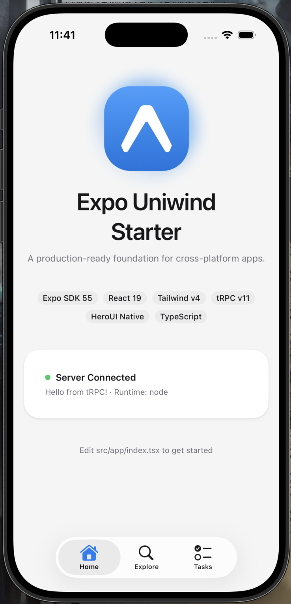
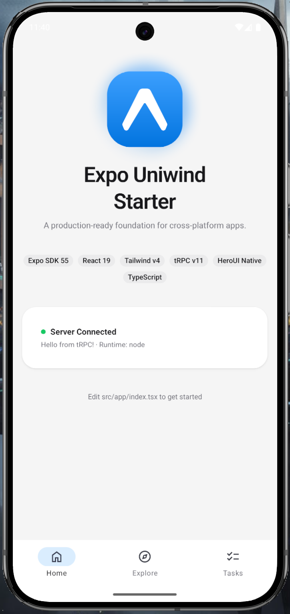

# Expo Uniwind Starter

**Ship cross-platform apps with Tailwind CSS v4 styling, ready-made components, and zero config pain.**

[](https://expo.dev)
[](https://reactnative.dev/)
[](https://www.typescriptlang.org/)
[](https://pnpm.io/)

<p align="left">
  
  &nbsp;&nbsp;&nbsp;&nbsp;
  
</p>

## What's included

- **Tailwind CSS v4** via [Uniwind](https://uniwind.dev/) — utility-first styling that works on native and web
- **[HeroUI Native](https://v3.heroui.com/docs/native/getting-started)** — polished component library with buttons, inputs, accordions, and more
- **Dark mode** — full light/dark theming via CSS variables, one file to customize
- **Expo Router** — file-based routing with typed routes and native tab navigation
- **[Tanstack Form](https://tanstack.com/form)** — composable, type-safe forms via `createFormHook` with Zod validation
- **[Nitro](https://nitro.build/) + [tRPC](https://trpc.io/)** — type-safe API server in a monorepo workspace, deployable to Cloudflare Workers
- **React 19 + React Compiler** — latest React with automatic optimizations
- **Strict TypeScript, ESLint, Prettier** — opinionated DX with import and Tailwind class sorting
- **Jest + React Native Testing Library + Vitest** — frontend and server unit tests with app providers and tRPC test helpers
- **Agent skills** — context-aware guidance for HeroUI Native, React correctness, and reusable composition patterns
- **Codex harness instructions** — local iOS simulator validation through the Browser Use plugin

## Prerequisites

- Node.js version pinned in `.node-version`
- pnpm pinned by `packageManager` in `package.json`
- Xcode (for iOS simulator) and/or Android Studio (for Android emulator)

## Quick start

**1. Clone the template:**

```bash
npx degit AdiRishi/expo-uniwind-starter acme-mobile
cd acme-mobile
pnpm install
```

**2. Rename the project** — updates package.json, app.json, and bundle identifiers:

```bash
pnpm run rename acme-mobile com.mycompany
```

**3. Start the API server:**

```bash
pnpm run server:dev   # Nitro dev server on localhost:3000
```

**4. Build and run** (in a separate terminal):

```bash
pnpm expo prebuild
pnpm ios              # iOS simulator
pnpm android          # Android emulator
pnpm web              # Web browser
```

## Testing

Frontend unit tests run with Jest and React Native Testing Library. Server unit tests run with Vitest.

```bash
pnpm run test           # app + server tests
pnpm run test:app       # app tests only
pnpm run server:test    # server tests only
pnpm run test:app:types
```

App tests live in the root `tests/` directory and mirror `src/` paths, with shared helpers in `tests/testing-utils/`. Use small scenario-explicit builders for repeated data shapes, and keep feature-specific mocks in the test or harness that needs them. Server tests live under `server/tests/` and mirror backend paths.

## Tech stack

| Layer      | Technology                                   |
| ---------- | -------------------------------------------- |
| Framework  | Expo 55 + React Native 0.83                  |
| Routing    | Expo Router (file-based, typed routes)       |
| Styling    | Tailwind CSS v4 via Uniwind                  |
| Components | HeroUI Native                                |
| Animations | React Native Reanimated 4                    |
| Server     | Nitro 3 (Cloudflare Workers)                 |
| Forms      | Tanstack Form + Zod                          |
| API        | tRPC v11 + TanStack Query                    |
| Testing    | Jest + React Native Testing Library + Vitest |
| Language   | TypeScript 5.9 (strict)                      |

## Project structure

```
src/
  app/                      → Routes (thin files that render screens)
  screens/                  → Screen components with page logic
  components/
    ui/                     → Design system primitives (buttons, typography, containers)
    form/                   → Tanstack Form field and form components
    screens/<screen-name>/  → Components specific to a single screen
  hooks/                    → Custom hooks (theme colors, form context, etc.)
  schemas/                  → Zod validation schemas
  lib/                      → tRPC client, environment config
  global.css                → Theme tokens — edit this to customize your app
server/
  routes/                   → Nitro API routes
  trpc/                     → tRPC router and procedure definitions
```

## Agent validation

This starter includes a Codex harness for validating native changes end-to-end. Agents can launch the app, drive the iOS simulator through the Browser Use plugin, verify the result, run checks, and clean up.

https://github.com/user-attachments/assets/0b875e4d-f8d2-4b47-bb69-2270725f9c9e

## Resources

- [Expo docs](https://docs.expo.dev/)
- [Uniwind](https://uniwind.dev/)
- [HeroUI Native](https://v3.heroui.com/docs/native/getting-started)
- [Tailwind CSS v4](https://tailwindcss.com/)
- [Nitro](https://nitro.build/)
- [tRPC](https://trpc.io/)
- [TanStack Query](https://tanstack.com/query)
- [TanStack Form](https://tanstack.com/form)
